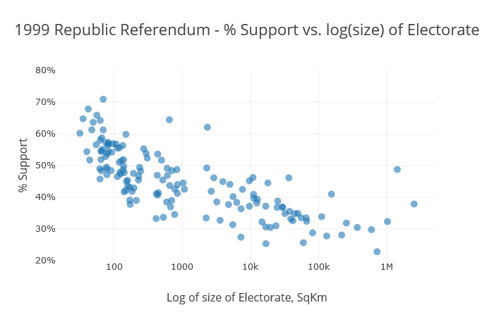
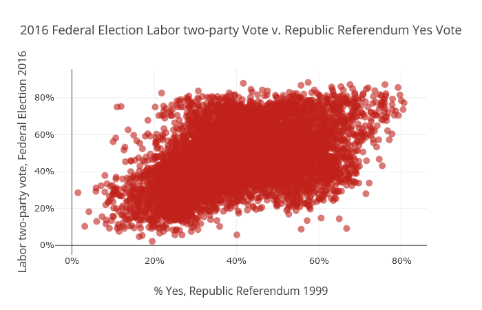
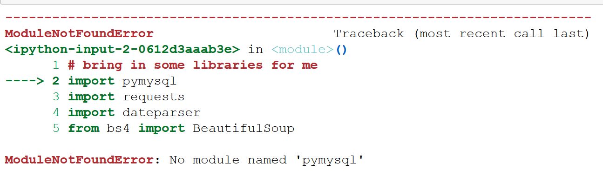

# 1999 Australian Referenda

This repo includes some data processing for, and analysis of, the two Australian Referenda of 1999.

## What is all this?

This is a series of functions to process and analyse the results of the 1999 Australian Referenda.

Some interesting tidbits include that you can explain 56% of the variation in support for the Australian Republic in 1999 just with the physical size of the electorate:


Matching the results of the Republic Referendum to the results of the 2016 Federal Election, I show that you can explain 19% of the variation in 2016 Labor Two-Party vote with the results of the 1999 Republic Referendum:


## Getting Started

- pipenv for virtual environment, setup taken from this guide https://hackernoon.com/reaching-python-development-nirvana-bb5692adf30c, as well as https://dev.to/py3course/setting-up-a-python-environment-in-2020-3e9e
- pyenv for python versioning, setup here https://github.com/pyenv/pyenv
install via `curl https://pyenv.run | bash`

add this to ~/.bashrc:

export PATH="$HOME/.pyenv/bin:$PATH"
export PATH="$PYENV_ROOT/bin:$PATH"

if command -v pyenv 1>/dev/null 2>&1; then
    eval "$(pyenv init -)"
fi

eval "$(pyenv init --path)"
eval "$(pyenv init -)"

- I use this vscode extension to remotely run python https://code.visualstudio.com/docs/remote/wsl-tutorial
- To get jupyter going in a pipenv https://towardsdatascience.com/how-to-use-pipenv-with-jupyter-and-vscode-ae0e970df486

### Some details

This code is written in Python 3, and is implemented in Jupyter Notebooks.

The project is spread across four notebooks at this stage:

### referenda_1999_clean_polling_places

This notebook:
* loops over the spreadsheets representing 1999 polling places
* outputs one spreadsheet containing each physical polling place in the country

### referenda_1999_geocode_polling_places

This notebook takes the output from the previous one, and attempts to get a lat/lng for each polling place.

In order, it tries the following, giving up the first time it is successful:
* matching to 2007 Federal Election polling places, on state, postcode, and premesis being the same.
* matching to 2010 Federal Election polling places, on state, postcode, and premesis being the same.
* matching to 2013 Federal Election polling places, on state, postcode, and premesis being the same.
* matching to 2016 Federal Election polling places, on state, postcode, and premesis being the same.
* matching to 2007 Federal Election polling places, on state, postcode, and polling place name being the same.
* matching to 2010 Federal Election polling places, on state, postcode, and polling place name being the same.
* matching to 2013 Federal Election polling places, on state, postcode, and polling place name being the same.
* matching to 2016 Federal Election polling places, on state, postcode, and polling place name being the same.
* running the address through the google maps geocoder
* setting to the centroid of the suburb of the polling place
* manually setting five polling places to a specific set of co-ordinates

This isn't intended to be perfect, but rather to provide an approximate set of locations for each 1999 polling place.

### referenda_data_cleanup

This notebook defines a lot of functions for cleaning up results spreadsheets in the form released for both 1999 Referenda.

It currently produces two outputs:
* The result of the republic referendum by electorate by polling place
* The result of the republic referendum by polling place

These differ where the same polling place was a joint booth, for instance Croydon Park West, which had votes cast in both the Adelaide and Port Adelaide electorates.

In the latter .csv, the results are added together.

While not done currently, it would be quite simple to run this code over the results of the other 1999 referendum.

### republic_referendum_analytics

This notebook provides some reasonably simple anlaysis of the republic referendum, including:
* Result by state/territory
* Most/least supportive 1999 Federal Electorates
* Support for the Republic versus size of Electorate (r2 = 0.56)
* Support for the Republic versus 2016 Federal ALP Two-Party vote by polling place (r2 = 0.19)

This notebook also contains the code to match 1999 polling places to their nearest 2016 polling place, making the final piece of analysis above possible.

### Note of caution

In their infinite wisdom, the AEC gave the name "Hyde Park" to two different booths in NSW.

It is the only non-unique combination of `['state','polling_place']` in the country for the 1999 referenda.

In both the polling place and results notebooks, this is monkey patched so the two booths remain separate in the

AEC: 😠😞

## Getting Started

### Python & Jupyter

#### Using Windows

The author used the Anaconda installer on Windows 10, which can be found here: https://www.continuum.io/downloads.

This comes in the form of a standard *.exe, and you install through a UI.

This installer will also install python3 for you, if you don't already have it

#### Using Linux

Assuming Ubuntu, run the following:

```
sudo apt-get update
sudo apt-get install python3
sudo apt-get install python3-pip
sudo -H pip3 install --upgrade pip
sudo -H pip3 install jupyter
```

For help running notebooks at that point, check out http://jupyter.readthedocs.io/en/latest/running.html#running

### Python3 Libraries

This package makes use of many python3 libraries.

Some of these are installed by default.

If you are missing one, a code block will error like so:


To install a package:

#### Windows

* You will have a terminal prompt under Start, the 'Anaconda Prompt'.
* Run that as administrator, and install packages with:
`conda install packagename`

#### Linux

* install packages using:
`sudo -H pip3 install packagename`

#### This project makes use of these libraries:

* pandas
* xlrd
* os
* IPython
* numpy
* json
* plotly
* math
* statsmodels
* fiona
* geopandas
* shapely

#### Google Maps

Google Maps Geocoding API, through the library `googlemaps`, is used to geocode a few hundred addresses I couldn't otherwise get a location for, in the `referenda_1999_geocode_polling_places` notebook.

For this to work correctly, you will need to put a valid key in `config/keys.json`.

The file is in the form:
```
{
	"google_maps" : "LoremIpsum"
}
```

Replace LoremIpsum with a valid key.

You can sign up for a key here: https://developers.google.com/maps/documentation/geocoding/start

#### Plotly

Plotly is an interactive charting library that integrates nicely into Jupyter Notebooks.

It has two modes, you can either run it locally, or you can run calls to its server to render your data into a plot image for you.

I do the vast majority of my work locally, aliasing plotly.offline to py

```
	import plotly.offline as py
	import plotly.plotly as pyonline
```

The only reason to include and make use of the online library is if you wish to return static images in code - the local library doesn't allow you to do that.

I have it here so I can export the notebooks in their entirety to PDFs, and have the images stay.

The cells rendering charts in my Notebooks usually look like this:

```
	py.iplot(figure01, filename='figure01')
	#pyonline.image.ishow(figure01, width=1500, height=750)
```
`py.iplot` is being run locally, and displaying an interactive output
`pyonline.image.ishow` would run remotely, and return a static image.

If you don't need the second feature, just comment out `import plotly.plotly as pyonline` wherever it occurs.

If you do need that feature, you will need to register for a plotly account, and get an API key.

This is free, and can be done at https://plot.ly/

You will then need to run this to set that key up locally. This need only be done once after install:

```
	import plotly 
	plotly.tools.set_credentials_file(username='DemoAccount', api_key='thisisakey')
```

Don't save this code in a notebook you use, it's bad practice to have code and keys in the same file!

## Authors

* **Jake Clarke** - [jaketclarke](https://github.com/jaketclarke) - jake at theredfox dot group

## License

This project is licensed under the MIT Licence - see the [LICENCE.md](LICENCE.md) file for details.

For a much more human friendly version, see here: https://choosealicense.com/licenses/mit/#

In short, you can use this, you can't hold me liable, and you have to credit me ;-)

## Thanks

* to David Michael, for sensibly keeping a CD of the data released by the AEC after the referenda.
* to Zach Alexopoulos, for nudging me to do this, and proofing this project.